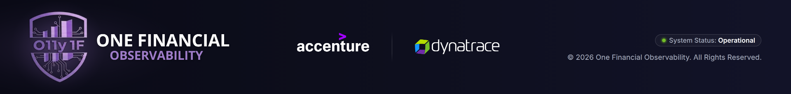

# Banner One Financial Observability × Accenture × Dynatrace

Banner co-branded para divulgação dentro do Dynatrace, redesenhado a partir do banner original com
foco em profissionalismo, **logo oficial da Accenture** e **preservação do logo One Financial
Observability (O11y 1F)**.



## Arquivos

| Arquivo | Uso |
| --- | --- |
| `output/o11y-1f-accenture-dynatrace-banner.png` | **Banner final, 3840 × 461 px**: mesmas dimensões do original, substituição direta |
| `output/o11y-1f-accenture-dynatrace-banner-1920.png` | Versão leve, 1920 × 231 px |
| `banner.html` | Fonte editável (HTML/CSS, sem dependências de rede) |
| `assets/` | Emblema O11y 1F, logos oficiais (SVG) e fontes locais (Open Sans Bold, Inter; licença OFL 1.1) |
| `render.js`, `package.json` | Script para gerar os PNGs a partir do HTML |
| `docs/comparativo-opcoes.jpg` | Antes × depois e as 4 direções de design avaliadas |
| `docs/antes-original.jpg` | Banner original, para referência |

## O que mudou em relação ao original

- **Fundo**: a foto de escritório (com os “3” soltos no vidro) virou um gradiente índigo-marinho
  sóbrio, com um halo roxo discreto só atrás do emblema.
- **Hierarquia em três zonas num único eixo horizontal**:
  1. **Logo O11y 1F**: marca principal, à esquerda.
  2. **Accenture | Dynatrace**: logos parceiros, ao centro, com o mesmo peso visual.
  3. **Selo de status + copyright**: à direita, legíveis mesmo em meia escala.
- **Accenture adicionada** com o logo oficial.
- Grid, margens e espaçamentos consistentes. O copyright ganhou tamanho e contraste, e o
  “System Status: Operational” virou um selo com indicador verde.

## Logos e regras de marca

- **One Financial Observability (O11y 1F)**, preservado:
  - O **emblema** foi recortado do banner original **sem nenhuma alteração** (306 × 369 px, apenas
    com o fundo removido) e é exibido no tamanho nativo, sem ampliação.
  - O **nome** usa a mesma fonte do original (**Open Sans Bold**, comparada lado a lado), com
    “ONE FINANCIAL” em branco e “OBSERVABILITY” no roxo original (matiz 267°, só um pouco mais claro
    para dar contraste). A segunda linha continua recuada, e as proporções entre emblema e nome são
    as do original.
- **Accenture**: lockup oficial com o wordmark “accenture” e o símbolo `>` em roxo **#A100FF**, na
  versão reversa (wordmark branco) indicada para fundos escuros. O wordmark foi conferido contra o
  SVG publicado em accenture.com (sobreposição de 98,6%).
- **Dynatrace**: SVG oficial extraído do cabeçalho de dynatrace.com (wordmark branco + símbolo colorido).
- Os logos são usados **sem modificação**: sem filtros, efeitos, recoloração ou distorção, com
  área de proteção ao redor e proporção de altura Accenture:Dynatrace de 1,26 para equilibrar o
  peso visual.

> Accenture e Dynatrace são marcas registradas de seus respectivos titulares. Para peças oficiais de
> co-marketing, vale confirmar o uso com os times de marca/parcerias das duas empresas.

## Como o design foi escolhido

Foram produzidas 4 direções (Executive minimal, Premium gradient accent, Structured partner bar e
Telemetry motif). Três avaliadores deram notas a cada uma:

- conformidade de marca;
- qualidade visual;
- encaixe e legibilidade dentro do Dynatrace, em tamanhos reduzidos e sobre fundos de UI claro e
  escuro.

A vencedora (Executive minimal, 25/30) foi refinada com as correções apontadas. Em seguida passou
por verificações automáticas de:

- medidas;
- integridade dos arquivos de logo;
- fontes carregadas;
- contraste do texto;
- fidelidade do logo O11y 1F em relação ao original.

Veja `docs/comparativo-opcoes.jpg`.

## Editar e gerar novamente

```bash
cd o11y-1f-banner
npm install
npx playwright install chromium
npm run render      # gera os dois PNGs em output/
```

Os textos, cores e posições ficam em `banner.html`, e o grid está documentado no comentário do topo.
Se o texto ou algum tamanho mudar, recentre `.partners` para manter iguais os espaços entre as zonas.

**Limitação conhecida:** o emblema O11y 1F veio do JPEG original, então é um bitmap levemente
suave em 100% de zoom. No tamanho de exibição (~1920 px) ele fica nítido. Se houver uma versão
vetorial ou em alta resolução do emblema, basta substituir `assets/o11y-1f-emblem.png` mantendo a
proporção 306:369.
